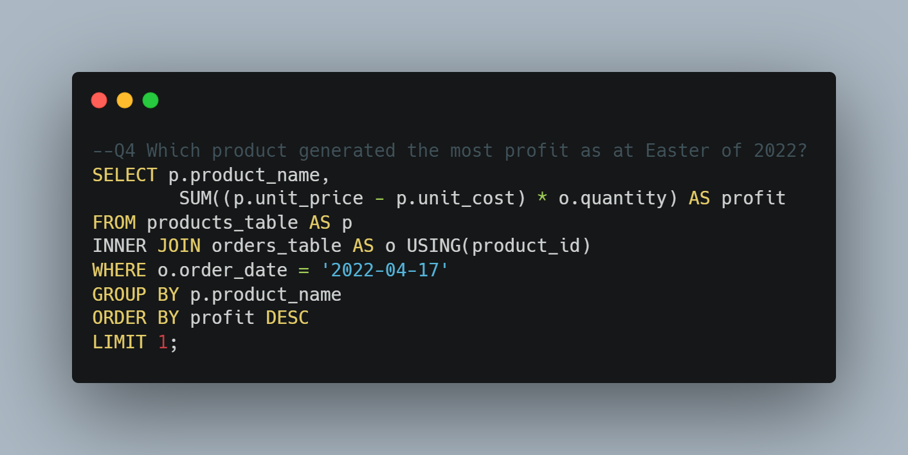

# Instacart
---
# Sales Analysis
---
## by Winnie Ngaji
---
   
---
# INTRODUCTION
---
Instacart is an American delivery company specialising in grocery delivery and pick-up services, catering to customers in the United States and Canada. The company facilitates seamless access to its services by utilizing both a website and a mobile app. Customers can place orders for groceries from various participating retailers, with the actual shopping conducted by a dedicated personal shopper.

This project aims to conduct a comprehensive analysis of Instacart's business data through SQL queries, aiming to provide actionable insights and answers to key business questions. 

---
# PROJECT OBJECTIVE
I will use the provided dataset to understand Instacart's operational performance, customer preferences, and overall financial success over various periods and product categories. Specifically, I aim to answer the following business questions:

* Q1 What are the top-selling products by revenue, and how much revenue have they generated?
* Q2 Which aisles have the highest sales volume?
* Q3 Which 3 departments generated the most profit in 2019?
* Q4 Which product generated the most profit as of Easter of 2022?
* Q5 Which year did Instacart generate the most profit?
* Q6 What are the top 5 products that generated the most revenue from Xmas 2022 till 2nd of January 2023 and their profits?
* Q7 What time of the day has the highest order volume during the entire Covid Period?
* Q8 What is the total revenue generated in Qtr. 2 & 3 of 2016?
* Q9 Which 3 products do people buy at night(2020 - 2022)?
* Q10 What is the total revenue generated from juice products?

---
# SKILLS DEMONSTRATED
I used advanced SQL functions to import the dataset into PostgreSQL and did some analysis to query the database

# DATA MODELLING
I carefully crafted a robust database schema using PostgreSQL to ensure optimal organization and efficiency. I defined tables, established relationships, and implemented constraints to maintain data integrity.
      

---
### DATA MODEL
     

# DATA ANALYSIS AND VISUALIZATION
I will leverage this database to address and resolve key business challenges that the organization is keen on understanding and solving. By harnessing the power of the structured data and relationships established through PostgreSQL, I aim to provide insightful solutions that contribute to informed decision-making and strategic advancements within the business.

# BUSINESS QUESTIONS
* ### Q1 What are the top-selling products by revenue, and how much revenue have they generated?
### QUERY
   
### RESULT
   
**INSIGHT:::** The top-selling product is Vanilla, Tangerine & Shortbread Ice Cream with a total revenue of $11,184

* ### Q2 Which aisles have the highest sales volume?
### QUERY
   
### RESULT
   
**INSIGHT:::** The "missing" aisle has the highest sales volume with about 147,708 products sold

* ###  Q3 Which 3 departments generated the most profit in 2019?
### QUERY
   
### RESULT
   
**INSIGHT:::** The top 3 departments were "Personal Care, snacks and Pantry" and they generated profits of $255,428.70, $244,086.40 and $207,408.90 respectively.

* ### Q4 Which product generated the most profit as of Easter of 2022?
### QUERY
   
### RESULT
   
**INSIGHT:::** The product that generated the most profit during the easter period of 2022 was "Chocolate Chip Mini Cookies" with a profit of $79.90.

* ### Q5 Which year did Instacart generate the most profit?
### QUERY
   
### RESULT
   
INSIGHT::: The business generated the most profit of $1,928,129 in 2020

* ### Q6 What are the top 5 products that generated the most revenue from Xmas 2022 till 2nd of January 2023 and their profits?
### QUERY
   
### RESULT
   
**INSIGHT:::** The product that generated the most profit during the easter period of 2022 was "Chocolate Chip Mini Cookies" with a profit of $79.90.

* ### Q7 What time of the day has the highest order volume during the entire COVID period?
### QUERY
   
### RESULT
   
**INSIGHT:::** 3 pm had the highest order volume of 14,153

* ## Q8 What is the total revenue generated in Qtr. 2 & 3 of 2016?
### QUERY
   
### RESULT
   
**INSIGHT:::** Qtr. 2 & 3 of 2016 generated a total of $9,555,387 in Revenue

* ## Q9 Which 3 products do people buy at night(2020 - 2022)?
### QUERY
      
### RESULT
    
**INSIGHT:::** The 3 products people buy at night from 200 - 2022 were 

* ## Q10 What is the total revenue generated from juice products?
### QUERY
   
### RESULT
  
**INSIGHT:::** A total of $3,077,822 was generated from juice products

---
# RECOMMENDATION AND CONCLUSION

